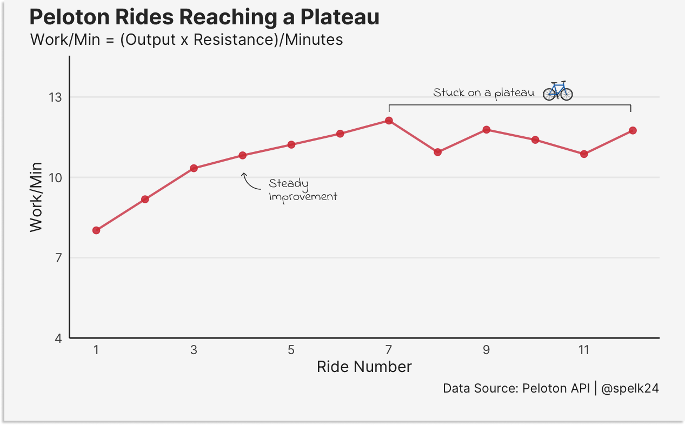
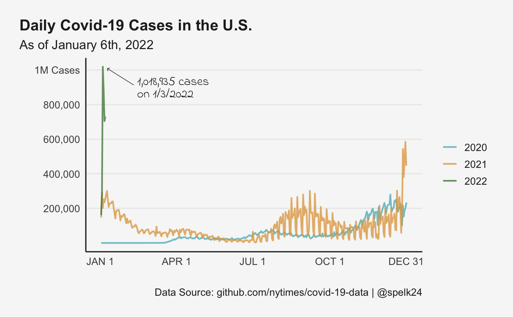

# TidyTuesday

Weekly Data Viz event for the #rstats community

[TidyTuesday Repository](https://github.com/rfordatascience/tidytuesday)

## Examples

### 2022 Week 1

Built some custom Peloton API functions [here](https://github.com/spelk24/TidyTuesday/functions/peloton-api.R) and explored how my Peloton output has fared so far on the bike.

### Daily Covid-19 Cases

Use of a simple line graph, in comparison to the serpent/spiral charts in [this twitter thread](https://twitter.com/Wattenberger/status/1479276091751768065), to track daily covid cases in the U.S.

